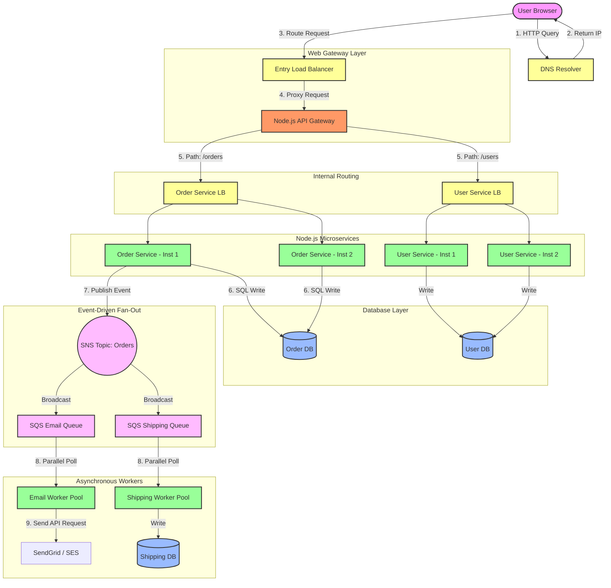
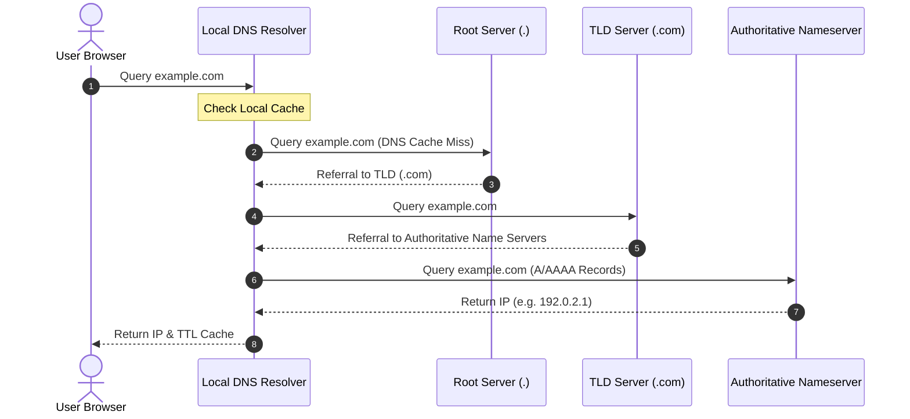
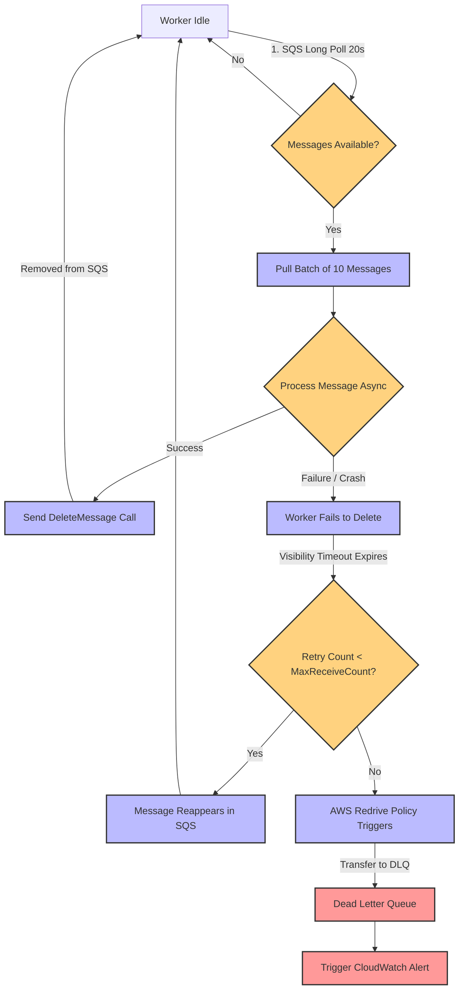

# System Design Interview Guide: Node.js Request Flow & Infrastructure

This guide details how a request flows through modern, distributed system infrastructure, **tailored specifically to the characteristics of the Node.js runtime environment** (Single-threaded Event Loop, Asynchronous Non-blocking I/O, V8 Memory Limits). 

Structured in the exact order a request travels—from DNS lookup to downstream Node.js microservices—it highlights **why we use each component**, **how they solve problems**, **pros & cons**, and critical **💡 Interview Deep Dives** focused on Node.js-specific architectural trade-offs.

---

## 📌 The End-to-End Request Journey
When a user types a URL (e.g., `https://example.com/orders`) into their browser, the request journeys through the following infrastructure:



---

## 📌 Table of Contents
1. [Domain Name System (DNS)](#1-domain-name-system-dns)
   - [1.1 Why We Use DNS & How It Solves the Problem](#11-why-we-use-dns--how-it-solves-the-problem)
   - [1.2 How It Works (DNS Lookup Workflow)](#12-how-it-works-dns-lookup-workflow)
   - [1.3 Pros and Cons of DNS](#13-pros-and-cons-of-dns)
   - [1.4 💡 Interview Deep Dive: DNS Design Questions](#14--interview-deep-dive-dns-design-questions)
2. [Scaling Node.js Applications](#2-scaling-nodejs-applications)
   - [2.1 Why We Use Scaling & How It Solves the Problem](#21-why-we-use-scaling--how-it-solves-the-problem)
   - [2.2 Vertical Scaling (Scaling Up Node.js)](#22-vertical-scaling-scaling-up-nodejs)
     - [2.2.1 Pros and Cons of Node.js Vertical Scaling](#221-pros-and-cons-of-nodejs-vertical-scaling)
   - [2.3 Horizontal Scaling (Scaling Out) & Entry Load Balancers](#23-horizontal-scaling-scaling-out--entry-load-balancers)
     - [2.3.1 Why We Use a Load Balancer in Horizontal Scaling](#231-why-we-use-a-load-balancer-in-horizontal-scaling)
     - [2.3.2 Load Balancing Algorithms & Mechanisms (L4 vs. L7)](#232-load-balancing-algorithms--mechanisms-l4-vs-l7)
     - [2.3.3 Pros and Cons of Horizontal Scaling & Load Balancing](#233-pros-and-cons-of-horizontal-scaling--load-balancing)
     - [2.3.4 💡 Interview Deep Dive: Consistent Hashing & High Availability](#234--interview-deep-dive-consistent-hashing--high-availability)
3. [Node.js Microservices Architecture](#3-nodejs-microservices-architecture)
   - [3.1 Why We Use Microservices & How It Solves the Problem](#31-why-we-use-microservices--how-it-solves-the-problem)
   - [3.2 The Node.js API Gateway (Unified Entry Point)](#32-the-nodejs-api-gateway-unified-entry-point)
     - [3.2.1 Why We Use an API Gateway & How It Solves Routing Problems](#321-why-we-use-an-api-gateway--how-it-solves-routing-problems)
     - [3.2.2 Pros and Cons of a Node.js API Gateway](#322-pros-and-cons-of-a-nodejs-api-gateway)
     - [3.2.3 💡 Interview Deep Dive: Rate Limiting & Gateway Failover](#323--interview-deep-dive-rate-limiting--gateway-failover)
   - [3.3 Service-Specific Load Balancers (Request-Based Routing)](#33-service-specific-load-balancers-request-based-routing)
     - [3.3.1 Why We Use Service-Specific Load Balancers](#331-why-we-use-service-specific-load-balancers)
     - [3.3.2 How It Solves the Internal Service Routing Problem](#332-how-it-solves-the-internal-service-routing-problem)
     - [3.3.3 Pros and Cons of Service-Specific Load Balancers](#333-pros-and-cons-of-service-specific-load-balancers)
     - [3.3.4 💡 Interview Deep Dive: Client-Side vs. Server-Side Load Balancing](#334--interview-deep-dive-client-side-vs-server-side-load-balancing)
   - [3.4 The Downstream Node.js Microservices](#34-the-downstream-nodejs-microservices)
     - [3.4.1 Why We Deploy Separate Services](#341-why-we-deploy-separate-services)
     - [3.4.2 Pros and Cons of Node.js Microservices Architecture](#342-pros-and-cons-of-nodejs-microservices-architecture)
     - [3.4.3 💡 Interview Deep Dive: Distributed Transactions & Join Patterns](#343--interview-deep-dive-distributed-transactions--join-patterns)
4. [Batch Processing & Queue Architecture in Node.js](#4-batch-processing--queue-architecture-in-nodejs)
   - [4.1 Why We Use Batch Processing & How It Solves the Problem](#41-why-we-use-batch-processing--how-it-solves-the-problem)
   - [4.2 Core Architecture & Workflow (BullMQ & Streams)](#42-core-architecture--workflow-bullmq--streams)
   - [4.3 Pros and Cons of Node.js Batch Processing](#43-pros-and-cons-of-nodejs-batch-processing)
   - [4.4 💡 Interview Deep Dive: Batch vs. Stream Processing (Lambda vs. Kappa)](#44--interview-deep-dive-batch-vs-stream-processing-lambda-vs-kappa)
   - [4.5 💡 Interview Case Study: Asynchronous Payment Email Workers & Queue Bottlenecks (AWS SQS)](#45--interview-case-study-asynchronous-payment-email-workers--queue-bottlenecks-aws-sqs)
   - [4.6 💡 Interview Deep Dive: Queue Polling Mechanics — Long Polling vs. Short Polling](#46--interview-deep-dive-queue-polling-mechanics--long-polling-vs-short-polling)
   - [4.7 💡 Interview Deep Dive: Message Queue (SQS) vs. Pub/Sub vs. Database (SQL) as a Queue](#47--interview-deep-dive-message-queue-sqs-vs-pubsub-vs-database-sql-as-a-queue)
     - [4.7.5 💡 Gold Standard Pattern: SNS + SQS Fan-Out](#475--gold-standard-pattern-sns--sqs-fan-out)
     - [4.7.6 💡 Interview Deep Dive: Fault Tolerance in SNS + SQS Fan-Out Architecture](#476--interview-deep-dive-fault-tolerance-in-sns--sqs-fan-out-architecture)

---

## 1. Domain Name System (DNS)

### 1.1 Why We Use DNS & How It Solves the Problem
*   **The Problem:** Computers identify and connect to each other over the network using numerical IP addresses. Humans cannot easily memorize these number sequences. Furthermore, if a server's IP address changes due to migrations, hardware failure, or scaling, hardcoded client configurations will break immediately.
*   **How DNS Solves It:** DNS acts as the "phonebook of the Internet". It translates human-readable domain names (e.g., `google.com`) into machine-readable IP addresses dynamically, separating user navigation from physical infrastructure configurations.

### 1.2 How It Works (DNS Lookup Workflow)
The sequence below illustrates the step-by-step query propagation of a DNS lookup:



### 1.3 Pros and Cons of DNS
*   **Pros:**
    *   **User Friendliness:** Enables human-readable domains, boosting brand accessibility.
    *   **Abstraction Layer:** Decouples domain names from host IPs, facilitating seamless server migrations.
    *   **Global Traffic Management (GeoDNS):** Resolves requests to the geographically closest data center IP, reducing latency and scaling traffic globally.
*   **Cons:**
    *   **Cache Propagation Delay:** Changes to DNS records can take hours (or days) to distribute globally because clients cache old IPs until their TTL expires.
    *   **Security Vulnerabilities:** DNS queries are traditionally unencrypted, making them susceptible to **DNS hijacking**, **cache poisoning (spoofing)**, and large-scale DDoS attacks.
    *   **SPOF Dependency:** If your authoritative DNS provider goes offline (e.g., Dyn DNS attack), your domain becomes completely unreachable.

### 1.4 💡 Interview Deep Dive: DNS Design Questions
> [!NOTE]
> **Q: How do massive websites implement high availability at the DNS level?**
> **A:** They use **Anycast Routing**. In Anycast, multiple physical servers in different locations share the exact same IP address. Routers use BGP (Border Gateway Protocol) to send the user's traffic to the topologically closest physical server. If one Anycast location fails, the network path dynamically recalculates to route traffic to the next closest location.

> [!TIP]
> **Q: What is the risk of setting a very low TTL (e.g., 0 seconds)?**
> **A:** While a low TTL allows near-instant failover and IP changes, it forces clients to request DNS lookups on every connection. This introduces significant latency to the request flow and places a heavy compute and cost load on your authoritative nameservers.

---

## 2. Scaling Node.js Applications

### 2.1 Why We Use Scaling & How It Solves the Problem
*   **The Problem:** An application experiencing growth faces high concurrent traffic. A default single-server configuration contains physical limitations (CPU, RAM, storage, network interface cards). When demand overflows these limits, servers experience thread starvation, memory swapping, connection drops, and eventual outages.
*   **How Scaling Solves It:** Scaling increases system resources to accommodate growth. It does this either by enhancing the capacity of the current machine (Vertical) or by adding more machines to split the load (Horizontal).

---

### 2.2 Vertical Scaling (Scaling Up Node.js)
Vertical scaling is the process of upgrading a single physical server by adding more resources (e.g., adding 64GB RAM, upgrading to a 32-core CPU).

> [!IMPORTANT]
> **Node.js Context:** Node.js executes JavaScript on a single thread. By default, running a Node.js process on a 32-core server will only utilize a **single CPU core**, leaving the other 31 cores idle. To scale vertically, Node.js applications must use the **Node.js Cluster Module** or a process manager like **PM2** to spawn one child process per CPU core, sharing the same master port.

#### 2.2.1 Pros and Cons of Node.js Vertical Scaling
*   **Pros:**
    *   **Simplicity:** Spawning processes via PM2 (`pm2 start app.js -i max`) requires no code changes.
    *   **Resource Utilization:** Fully utilizes multi-core hardware configurations.
    *   **Strict Consistency:** Simplifies database transactions because all transactions run on a single node without distributed consensus overhead.
*   **Cons:**
    *   **Hard Ceiling:** Limited by hardware technology limits. You cannot scale beyond the maximum configuration of a single motherboard.
    *   **Hardware SPOF:** If the motherboard, RAM, or power supply unit fails, the entire application crashes.
    *   **High Memory Overhead:** Spawning 32 Node.js processes creates 32 instances of the V8 engine, which consumes significantly more base RAM compared to multithreaded runtimes (like Go or Java).

---

### 2.3 Horizontal Scaling (Scaling Out) & Entry Load Balancers
Horizontal scaling is the process of adding more independent servers (nodes) to your resource pool to share the overall computational load.

#### 2.3.1 Why We Use a Load Balancer in Horizontal Scaling
*   **The Problem:** Simply turning on 10 new servers does not solve the scaling issue unless incoming client traffic can be split among them. If clients send requests randomly or to a single IP address, servers will experience unbalanced distribution—leaving some servers overloaded while others sit idle.
*   **How the Load Balancer Solves It:** The Load Balancer (LB) acts as a single endpoint for clients. It intercepts incoming traffic and distributes it systematically across the backend pool using health checks to bypass failed instances.

#### 2.3.2 Load Balancing Algorithms & Mechanisms (L4 vs. L7)
*   **Routing Algorithms:**
    *   *Round Robin:* Sequentially distributes requests. Best for identical hardware servers.
    *   *Least Connections:* Sends traffic to servers with the lowest active concurrent connections. Perfect for varying query complexities.
    *   *IP Hash:* Uses client IP hash to map requests to the same backend server (supports session stickiness).
*   **Layer 4 (L4) vs. Layer 7 (L7) Balancing:**
    *   *L4 (Transport Layer):* Routes traffic fast without opening the packet payload (uses TCP/UDP ports/IPs). Extremely fast.
    *   *L7 (Application Layer):* Inspects HTTP headers, cookies, and URI paths (e.g., routing `/auth` to one server and `/images` to another). Offers highly flexible routing.

#### 2.3.3 Pros and Cons of Horizontal Scaling & Load Balancing
*   **Pros:**
    *   **Theoretical Infinite Scale:** You can endlessly add standard nodes as user count rises.
    *   **High Availability:** Instantly shifts traffic away from crashed instances.
    *   **Zero-Downtime Deployments:** Allows rolling updates where servers are upgraded one by one without stopping the service.
*   **Cons:**
    *   **Complex Management:** Requires monitoring, log aggregation, and orchestration (e.g., Kubernetes).
    *   **Session Management:** Sessions must be stateless. Node.js processes cannot store sessions in memory; they must use shared caches like **Redis** since requests from the same user might hit different servers.
    *   **Network Overhead:** Adds network hops and latency as data traverses from Load Balancer -> Server -> Database.

#### 2.3.4 💡 Interview Deep Dive: Consistent Hashing & High Availability
> [!IMPORTANT]
> **Q: What is Consistent Hashing and why is it preferred over simple hashing (`hash(key) % N`) when scaling server rings?**
> **A:** In standard modular hashing, if the number of servers ($N$) changes (e.g., a node fails or scales up), almost all keys are mapped to different servers. This instantly invalidates caches, triggering a database-destroying cache stampede. 
>
> **Consistent Hashing** maps both the keys and the servers to a circular ring (hash ring). A key is assigned to the next closest server in a clockwise direction. When a server is added or removed, **only a fraction of the keys ($K/N$) need to be remapped**, preserving cache hit rates and system performance.
>
> ```
>               Server A (Hash 100)
>              /                  \
>             /                    \
>   Key 2 (Hash 350)              Key 1 (Hash 120) -> Mapped to Server A
>           \                        /
>            \                      /
>             Server B (Hash 300) ───
> ```

> [!WARNING]
> **Q: How do you prevent the entry-level Load Balancer from becoming a Single Point of Failure (SPOF)?**
> **A:** Set up an **Active-Passive pair** with a shared Virtual IP (VIP). The active load balancer broadcasts its heartbeat to the passive balancer using a protocol like VRRP (Virtual Router Redundancy Protocol). If the active node stops broadcasting heartbeats, the passive node instantly assumes the Virtual IP and continues processing traffic without downtime.

---

## 3. Node.js Microservices Architecture

### 3.1 Why We Use Microservices & How It Solves the Problem
*   **The Problem:** In a massive **Monolithic Architecture**, all business modules (authentication, catalog, shipping, notifications) are packaged into a single codebase.
    *   A bug in the notification module can leak memory and crash the whole application.
    *   Scaling requires scaling the entire monolith, duplicating unused resources.
    *   Large engineering teams face bottlenecked code deployment queues and continuous merge conflicts.
*   **How Microservices Solve It:** The system divides the application into a network of small, specialized, and loosely coupled services. Each service owns its database and communicates via lightweight APIs (HTTP, gRPC, or events).

---

### 3.2 The API Gateway (Unified Entry Point)

#### 3.2.1 Why We Use an API Gateway & How It Solves Routing Problems
*   **The Problem:** With a microservice architecture, clients (e.g., mobile apps) would have to call dozens of individual downstream endpoints. This forces the client to handle authentication repeatedly, exposes internal microservice IPs to the public internet, and creates high latency due to multiple round-trips.
*   **How API Gateway Solves It:** It serves as a unified proxy front-end. The gateway intercepts all requests, handles cross-cutting concerns (authentication, SSL decryption, rate limiting), and maps public paths to internal services (e.g., `/orders` routes to the internal Orders service).

#### 3.2.2 Pros and Cons of a Node.js API Gateway
*   **Pros:**
    *   **High Asynchronous Throughput:** Node.js API Gateways (built on NestJS, Fastify, or Express Gateway) excel at proxying requests because the non-blocking I/O event loop handles thousands of concurrent socket connections efficiently without spawning new threads.
    *   **Security Perimeter:** Shields internal microservice networks from direct exposure.
    *   **Client Abstraction:** Clients connect to one clean endpoint, decoupling clients from internal refactoring.
*   **Cons:**
    *   **CPU Blockage Vulnerability:** Since Node.js is single-threaded, if your Node.js Gateway attempts CPU-bound work (e.g., parsing large payloads, complex encryption, or image transformation), **the event loop will freeze**, blocking all incoming traffic.
    *   **SPOF Risk:** If the API Gateway fails, the entire application becomes inaccessible.
    *   **Increased Latency:** Adds an extra hop to every external request.

#### 3.2.3 💡 Interview Deep Dive: Rate Limiting & Gateway Failover
> [!IMPORTANT]
> **Q: What rate-limiting algorithms are implemented in API Gateways?**
> 1.  **Token Bucket:** A bucket holds a maximum number of tokens. Tokens are added at a constant rate. Every request consumes a token. If the bucket is empty, requests are dropped. *Allows for traffic bursts.*
> 2.  **Leaky Bucket:** Requests enter a queue (bucket) and flow out at a constant, fixed rate. If the queue overflows, requests are dropped. *Smooths out traffic spikes.*
> 3.  **Sliding Window Counter:** Tracks the count of requests made in the current window and calculates the fraction of requests from the previous window. *Highly accurate; avoids boundary limit spikes.*

---

### 3.3 Service-Specific Load Balancers (Request-Based Routing)

#### 3.3.1 Why We Use Service-Specific Load Balancers
*   **The Problem:** Once the API Gateway determines that a request for `/orders` must go to the `Order Service`, it cannot simply route it to a hardcoded IP. In a horizontal environment, the `Order Service` itself consists of 5 or 10 separate running container instances that are constantly scaling up, scaling down, or restarting.
*   **How It Solves It:** Service-specific load balancers sit between the API Gateway and the downstream service instances. They coordinate with a **Service Registry** (like Consul or Kubernetes CoreDNS) to automatically distribute the gateway's request among the currently active, healthy instances of that specific microservice.

#### 3.3.2 How It Solves the Internal Service Routing Problem
1.  **Service Registration:** When a new `Order Service` instance spins up, it registers its IP with the Service Registry.
2.  **Health Verification:** The registry checks its health.
3.  **Load Balancing:** The service-specific load balancer queries the registry and routes the API Gateway's request to a healthy instance.

#### 3.3.3 Pros and Cons of Service-Specific Load Balancers
*   **Pros:**
    *   **Dynamic Discovery:** Seamlessly handles internal dynamic scaling without manual routing configuration.
    *   **Targeted Failover:** If an individual service instance crashes, the service's internal LB isolates the failure immediately.
*   **Cons:**
    *   **Latency Accumulation:** Adding internal load balancers or sidecar proxies (service meshes) adds milliseconds to request times.
    *   **Debugging Difficulty:** Finding where a request failed in a multi-hop internal LB structure requires complex distributed tracing.

#### 3.3.4 💡 Interview Deep Dive: Client-Side vs. Server-Side Load Balancing
> [!IMPORTANT]
> **Q: What is the difference between Server-Side and Client-Side Load Balancing in microservices?**
>
> | Feature | Server-Side Load Balancing | Client-Side Load Balancing |
> | :--- | :--- | :--- |
> | **Mechanism** | Client hits a hardware/software LB (e.g., AWS Nginx), which proxies request. | Client queries Service Registry, caches IPs, and runs LB algorithm locally. |
> | **Network Hops** | Introduces an extra hop (Client -> LB -> Instance). | Direct call (Client -> Instance). No extra network hop. |
> | **Points of Failure**| Extra hardware component that can crash (SPOF). | Failures are localized to individual client instances. |
> | **Tech Stack** | Agnostic; handled entirely in the network infrastructure. | Requires specific library integration on client-side (e.g., Netflix Ribbon or gRPC Resolver). |

---

### 3.4 The Downstream Node.js Microservices

#### 3.4.1 Why We Deploy Separate Services
*   **The Design:** Microservices represent the final leaf nodes of the request journey. Each service executes its business logic independently, utilizing its isolated database schema (Database-per-Service pattern).

#### 3.4.2 Pros and Cons of Node.js Microservices Architecture
*   **Pros:**
    *   **Highly Polyglot friendly:** You can deploy quick I/O-heavy CRUD microservices in Node.js and CPU-bound ML microservices in Python.
    *   **Fault Isolation:** Memory leaks or exceptions in the Order microservice do not crash the User service.
    *   **Independent Deployments:** Node.js fast boot-up times (seconds) make microservices exceptionally compatible with auto-scaling Kubernetes nodes.
*   **Cons:**
    *   **V8 Memory Limits:** Each Node.js process has a default memory limit imposed by V8 (roughly ~1.4GB on 64-bit systems). If a microservice accumulates memory due to poor closure management or leaks, it will crash (`heap out of memory`) rapidly.
    *   **Distributed Data Transactions:** Joining data across services requires implementing event-driven eventual consistency patterns (e.g., Saga Pattern).

#### 3.4.3 💡 Interview Deep Dive: Distributed Transactions & Join Patterns
> [!CAUTION]
> **Q: How do you maintain transaction consistency across multiple microservices without using performance-degrading database locks (like Two-Phase Commit / 2PC)?**
> **A:** You implement the **Saga Pattern**. A Saga is a sequence of local transactions. Each local transaction updates the database inside a single service and publishes an event. Subsequent services listen to the event and execute their local transaction. 
> 
> If a transaction in the chain fails (e.g., payment fails after shipping is reserved), the Saga orchestrator/coordinator triggers **compensating transactions** in reverse order to undo the changes (e.g., release reserved shipping).

---

## 4. Batch Processing & Queue Architecture in Node.js

### 4.1 Why We Use Batch Processing & How It Solves the Problem
*   **The Problem:** Processing massive datasets (e.g., millions of records, generating monthly PDF invoices, daily bank reconciliations) requires prolonged CPU execution. Running these computations inside a standard Node.js server blocks the Single-threaded Event Loop, completely freezing the API and causing client requests to timeout.
*   **How Batch Processing Solves It:** It offloads heavy computations to a background job tier. We use distributed task queues where the Node.js API server acts only as a producer (pushing jobs to the queue) and separate, dedicated Node.js background workers consume and process these jobs, keeping the web server event loop responsive.

---

### 4.2 Core Architecture & Workflow (BullMQ & Streams)
To implement batch processing in Node.js, we employ the following architecture:

1.  **Job Producer (Express/Fastify Server):** Accepts the trigger and pushes a lightweight job payload into a Redis-backed queue.
2.  **Job Queue Broker (BullMQ):** A Redis-based distributed queue that manages retries, job states, scheduling, and locks.
3.  **Job Consumers (Node.js Background Workers):** Separate Node.js processes running on isolated hardware that poll Redis, lock jobs, and process them.
4.  **Node.js Streams API:** To prevent crashing workers due to V8 heap limits (~1.4GB), workers process files (CSVs, logs) chunk-by-chunk using **Streams** (`fs.createReadStream`, `Transform` streams) rather than loading entire files into memory.

---

### 4.3 Pros and Cons of Node.js Batch Processing
*   **Pros:**
    *   **Web Server Responsiveness:** Complete isolation of CPU-bound tasks keeps the client-facing event loop unblocked.
    *   **Memory Efficiency (Streams):** Processing large files in chunks allows Node.js to easily process 50GB files using less than 50MB of RAM.
    *   **Automatic Retries & Concurrency:** Tooling like BullMQ handles network failure retries and defines exact concurrency limits per worker.
*   **Cons:**
    *   **Single-Thread Worker Limit:** A single Node.js worker can still block its own thread when executing a CPU-intensive loop (e.g., image resizing). Workers must spawn **Worker Threads** (`worker_threads` module) or **Child Processes** for heavy compute.
    *   **Redis Dependency:** Distributed queuing via BullMQ relies heavily on Redis memory. Large queues can consume high Redis memory, requiring eviction management policies.
    *   **Data Latency:** Jobs are processed asynchronously, meaning the client must poll or establish WebSockets to learn when the batch job is finished.

---

### 4.4 💡 Interview Deep Dive: Batch vs. Stream Processing (Lambda vs. Kappa)
> [!IMPORTANT]
> **Q: How do you process a 10GB CSV file in Node.js without crashing the server due to Memory Limits?**
> **A:** You must avoid `fs.readFile()` because it attempts to load the entire 10GB file into V8's heap memory (which is capped at ~1.4GB), resulting in a `JavaScript heap out of memory` crash. 
> 
> Instead, you use **Node.js Streams** (`fs.createReadStream()`) combined with line-by-line parsers (e.g., the `readline` module or streaming CSV parsers like `csv-parser`). This reads the file in 64KB chunks, processes each line, and garbage-collects the processed chunks, keeping the memory footprint minimal and stable (under 100MB).
> 
> ```javascript
> const fs = require('fs');
> const readline = require('readline');
> 
> const fileStream = fs.createReadStream('massive_data.csv');
> const rl = readline.createInterface({
>   input: fileStream,
>   crlfDelay: Infinity
> });
> 
> rl.on('line', (line) => {
>   // Process single line in event loop without loading file to memory
>   processLine(line);
> });
> ```

> [!CAUTION]
> **Q: How does the Lambda Architecture map to Node.js environments?**
> **A:** In a Node.js ecosystem, processing real-time events (Speed Layer) is easily handled via a Node.js consumer subscribing to Kafka and updating a Redis cache. However, Node.js is poorly suited for the Batch Layer (which requires processing terabytes of data). The Batch Layer is typically delegated to JVM/Python tools like Apache Spark, while Node.js aggregates the final data in the Serving Layer and displays it to the client.

---

### 4.5 💡 Interview Case Study: Asynchronous Payment Email Workers & Queue Bottlenecks (AWS SQS)

In system design interviews, a classic problem is: **"Design a system to send confirmation emails immediately after a user makes a successful payment."**

#### 4.5.1 The Scenario: Decoupling Payment from Email Notification
If the checkout service calls the SMTP server/SendGrid API synchronously within the checkout HTTP request, the client request suffers from:
1.  **High Latency:** Email API calls usually take 1–3 seconds due to network handshakes.
2.  **Cascading Failures:** If the third-party email provider experiences downtime, the checkout request fails or hangs, leading to double-payments or abandoned carts.
3.  **Lack of Retry Handling:** If the connection drops mid-call, retrying it directly blocks the user interface.

#### 4.5.2 How the Queue Solves It (Asynchronous Worker Model)
Instead of a synchronous call, we introduce a message queue like **Amazon SQS** to decouple the services.
1.  **Checkout Service (Producer):** Receives the payment, writes order success to database, pushes a lightweight JSON payload `{ "orderId": "123", "email": "user@example.com" }` to SQS, and returns `200 OK` to the client in milliseconds.
2.  **Amazon SQS (Broker):** Safely buffers the messages across multiple availability zones.
3.  **Node.js Email Service (Consumer/Worker):** Runs as a pool of separate, background processes that constantly poll SQS for new messages, process them asynchronously (using `async/await` and Promises), send the emails via SendGrid/SES, and delete the messages from SQS once completed.

#### 4.5.3 Implementing Parallel Batch Processing
To process millions of emails/day, a single sequential worker is insufficient. We scale workers **in parallel**:
*   **Horizontal Worker Scaling:** Deploy multiple replicas of the Node.js email worker container (e.g., inside Kubernetes pods) that poll from the same SQS queue. SQS natively handles distributed message locking.
*   **Concurrent Polling in Node.js:** Within a single Node.js worker process, instead of processing one email at a time, we query SQS using the SDK’s batch options (e.g., retrieving up to 10 messages in a single call using `MaxNumberOfMessages: 10`). We then execute them in parallel using `Promise.all()` or a concurrency-limited library (like `p-map` or `async.mapLimit`) to prevent blocking the event loop or running out of memory.

```javascript
// Example of parallel worker consumption in Node.js
const { SQSClient, ReceiveMessageCommand, DeleteMessageCommand } = require("@aws-sdk/client-sqs");
const sqs = new SQSClient({ region: "us-east-1" });

async function emailWorkerLoop() {
  const queueUrl = "https://sqs.us-east-1.amazonaws.com/123456789012/EmailQueue";
  
  while (true) {
    try {
      const response = await sqs.send(new ReceiveMessageCommand({
        QueueUrl: queueUrl,
        MaxNumberOfMessages: 10,  // Pull messages in batch
        WaitTimeSeconds: 20       // Long Polling (reduces costs & empty receives)
      }));

      if (!response.Messages || response.Messages.length === 0) continue;

      // Process all fetched messages in parallel
      await Promise.all(response.Messages.map(async (message) => {
        try {
          const body = JSON.parse(message.Body);
          await sendEmailAsync(body.email, body.orderId); // Async email call
          
          // Delete message to tell SQS it is processed successfully
          await sqs.send(new DeleteMessageCommand({
            QueueUrl: queueUrl,
            ReceiptHandle: message.ReceiptHandle
          }));
        } catch (err) {
          console.error("Failed to process message:", err);
          // If execution fails, we do NOT delete the message. 
          // It will reappear in the queue after the Visibility Timeout expires.
        }
      }));
    } catch (error) {
      console.error("Queue Polling Error:", error);
      await new Promise(resolve => setTimeout(resolve, 5000)); // Cool down
    }
  }
}
```

#### 4.5.4 Handling Queue Bottlenecks (Rate Limits, Congestion, and Backpressure)
In a real-world interview, the interviewer will ask: **"What if your system generates 5,000 payments/sec, but SendGrid only allows you to send 1,000 emails/sec? How do you prevent queue congestion or API blocking?"**

1.  **Upstream Rate-Limiting & Throttling (Backpressure):** 
    We must implement **concurrency limiters** in our Node.js consumers. If the workers query the queue faster than the downstream API rate limit allows, SendGrid will respond with `429 Too Many Requests`. Node.js workers must limit how many parallel promises are resolved per second.
2.  **Queue Backlog & Auto-scaling:**
    If the consumer rate is lower than the production rate, messages will stack up in SQS. We set up an AWS CloudWatch alarm on `ApproximateNumberOfMessagesVisible` (Queue Depth) to trigger an Auto-scaling policy, spinning up more Node.js email worker containers.
3.  **Dead Letter Queue (DLQ):**
    If an email address is invalid (e.g., `test@invalid`), the worker will fail, and SQS will return the message to the queue after the visibility timeout. Left unchecked, this invalid message will loop forever, consuming resources.
    *   *Solution:* We configure a **Dead Letter Queue (DLQ)** on SQS. After a message fails processing $X$ times (defined by the `maxReceiveCount` in the Redrive Policy), SQS automatically transfers the message to the DLQ for manual debugging, keeping the main queue clean.
4.  **Visibility Timeout Management:**
    If processing a batch of emails takes longer than the queue's **Visibility Timeout** (e.g., worker takes 40s to process a batch, but Visibility Timeout is 30s), SQS will make those messages visible again while the worker is still running them. Another worker will pick them up, resulting in **duplicate emails** sent to users.
    *   *Solution:* Ensure the Visibility Timeout is set to at least 6 times the normal processing time of a message batch, or use the SQS API `ChangeMessageVisibility` to dynamically extend the timeout if a batch job is running long.

---

## 4.6 💡 Interview Deep Dive: Queue Polling Mechanics — Long Polling vs. Short Polling

In system design interviews involving message queues (such as AWS SQS), a fundamental design decision is how workers retrieve messages from the queue. This is governed by **Short Polling** and **Long Polling**.

### 4.6.1 Why We Use Polling & How It Works
*   **The Problem:** A queue worker needs to continuously fetch messages from a remote message broker. If the queue is empty, a standard HTTP request loop (polling) will immediately return an empty response. In a high-scale system, this results in workers generating millions of empty API requests, causing extreme CPU churn, high network usage, and exorbitant cloud API bills.
*   **How Polling Solves It:** Polling models establish a client-server query mechanism. By transitioning from Short Polling to Long Polling, we allow the server to hold the request open until data becomes available, optimizing network traffic and resource efficiency.

### 4.6.2 Short Polling
In Short Polling, when a consumer requests messages, the message queue samples a subset of its distributed database servers and immediately returns whatever messages are found on those servers—even if that list is empty.

*   **Pros:**
    *   **Instant Response:** Returns immediately, which can be useful in low-latency diagnostic test scenarios.
*   **Cons:**
    *   **High Financial Cost:** Cloud providers (like AWS SQS) charge per API request. A tight short-polling loop generates thousands of API calls per minute even on an empty queue, inflating costs.
    *   **False Empty Responses:** Because it only queries a subset of distributed queue servers, short polling might return an empty list even if messages exist on other un-sampled servers.
    *   **Worker CPU Churn:** Node.js workers spend CPU cycles parsing empty JSON payloads in a continuous loop.

### 4.6.3 Long Polling
In Long Polling, when a consumer requests messages, if the queue is empty, the queue server **holds the connection open** (typically up to 20 seconds). If a message arrives during this wait time, the server routes it to the connection immediately. If no message arrives before the timeout, it returns an empty response.

*   **Pros:**
    *   **Massive Cost Savings:** Eliminates the continuous loop of empty response cycles, reducing SQS billable API requests by up to 95% on low-traffic queues.
    *   **Eliminates False Empties:** SQS queries all of its distributed servers when a long poll request is open, ensuring all available messages are retrieved.
    *   **Low CPU & Network Utilization:** Workers stay idle waiting for the TCP socket to return data, preserving system resources.
*   **Cons:**
    *   **Persistent Socket Hold:** Holds open an active HTTP connection. (However, Node.js handles thousands of idle concurrent asynchronous connections natively using minimal memory).

### 4.6.4 Comparison: Short Polling vs. Long Polling

| Feature | Short Polling | Long Polling (Recommended) |
| :--- | :--- | :--- |
| **Response on Empty Queue** | Returns immediately with an empty list. | Holds connection open (up to 20s) waiting for data. |
| **Response on Message Arrival** | Returns immediately. | Returns immediately as soon as a message lands in the queue. |
| **Empty Requests Count** | Extremely high. | Extremely low. |
| **AWS SQS Bill Impact** | Expensive (per API call). | Very inexpensive (optimized request frequency). |
| **Consistency / Accuracy** | Low (queries subset of servers). | High (queries all servers). |
| **Network & CPU Overhead** | High (busy-waiting loops). | Low (asynchronous idle waiting). |

---

## 4.7 💡 Interview Deep Dive: Message Queue (SQS) vs. Pub/Sub vs. Database (SQL) as a Queue

In distributed systems, dispatching asynchronous work is a core design decision. Interviewers will frequently ask you to compare a **Message Queue** (like SQS), a **Pub/Sub system** (like AWS SNS or Apache Kafka), and using an existing relational **Database (SQL)** table as a queue.

### 4.7.1 Message Queue (Point-to-Point)
*   **How it Works:** Employs a Point-to-Point (1:1) architecture. A producer writes a message to a queue, and **exactly one worker** consumes and processes it. Once processed, the message is permanently deleted from the queue.
*   **Use Cases:** Task distribution, background compute (e.g., executing a single payment verification step or sending a transactional welcome email).
*   **Pros:** Native message locking (prevents workers from duplicating work), backpressure control, retry scheduling, and dead-letter queues.
*   **Cons:** Single-destination limitation. If multiple downstream services (e.g., Shipping, Inventory, Analytics) all need to know when an order is created, you cannot easily broadcast from a single queue.

### 4.7.2 Pub/Sub (Publish/Subscribe)
*   **How it Works:** Employs a One-to-Many (1:N) fan-out architecture. A publisher sends an event message to a **Topic**. The Pub/Sub broker duplicates and broadcasts that message in parallel to **all active subscribers** of that topic.
*   **Use Cases:** Event-driven architectures (e.g., publishing `OrderPlaced` which concurrently triggers inventory updates, shipping dispatch, marketing notifications, and analytics logging).
*   **Pros:** Highly decoupled. Publishers write events without knowing which downstream services exist. Adding a new downstream subscriber requires zero changes to the publisher code.
*   **Cons:** Ephemeral delivery (in classic systems like Redis Pub/Sub, if a subscriber goes offline, they miss the message permanently). Harder to distribute messages evenly across a pool of competing workers (unless using consumer groups like Kafka or SQS backends).

### 4.7.3 Database (SQL Table as a Queue)
*   **How it Works:** Uses an existing relational database table (e.g., `INSERT INTO jobs (id, task, status) VALUES (1, 'email_user', 'pending')`). Workers poll the table in a loop using specialized queries like:
    ```sql
    SELECT * FROM jobs 
    WHERE status = 'pending' 
    LIMIT 1 
    FOR UPDATE SKIP LOCKED; -- Locks row and skips already-locked rows
    ```
*   **Use Cases:** Low-scale, early-stage applications (under 100 jobs/sec) where introducing SQS, Redis, or Kafka adds unnecessary infrastructure overhead, complexity, and cost.
*   **Pros:** Ultimate simplicity (no new infrastructure). Transaction safety—you can commit your order write and your job write in the same atomic SQL transaction.
*   **Cons:** Locks database CPU and connection pools due to constant polling queries. Fails to scale horizontally beyond the limits of your primary relational database database.

### 4.7.4 Comparison: Message Queue vs. Pub/Sub vs. SQL Queue

| Feature | Message Queue (e.g., SQS) | Pub/Sub (e.g., SNS / Kafka) | SQL Table (FOR UPDATE SKIP LOCKED) |
| :--- | :--- | :--- | :--- |
| **Architecture Model** | Point-to-Point (1:1) | Fan-Out / Broadcast (1:N) | Database Polling (1:1) |
| **Decoupling Degree** | Medium | Extremely High | Low (tightly bound to DB CPU) |
| **Message Durability** | Built-in (persisted until consumed) | Ephemeral (SNS) / Durable (Kafka) | Highly Durable (ACID Compliant) |
| **Worker Load Balancing** | Native (Locks messages) | Harder (requires consumer groups) | Handled manually via `SKIP LOCKED` |
| **Infrastructure Overhead** | Medium (Managed SQS) | Medium to High (Kafka Cluster) | Zero (Runs on existing DB) |
| **Scale Limit** | Practically Infinite | Practically Infinite | Bound to Primary DB IOPS limits |

### 4.7.5 💡 Gold Standard Pattern: SNS + SQS Fan-Out
To achieve the best of both worlds—Pub/Sub broadcast decoupling and Queue reliability—system designers combine **AWS SNS** and **AWS SQS** in a **Fan-Out Pattern**.

*   **How it Works:** 
    1. The checkout service publishes an `OrderPlaced` event once to an **SNS Topic**.
    2. The SNS Topic is subscribed to by three independent **SQS Queues**: `EmailQueue`, `InventoryQueue`, and `ShippingQueue`.
    3. SNS automatically duplicates the message and pushes it to each queue.
    4. Dedicated worker pools poll their respective SQS queues in parallel. If `EmailQueue` workers fail, the message is retried without affecting the `ShippingQueue` or `InventoryQueue`.

```
                    [ Checkout Service ]
                             │ (Publish Event)
                             ▼
                     [ SNS Topic: Orders ]
                             │
            ┌────────────────┼────────────────┐
            ▼ (Broadcast)    ▼ (Broadcast)    ▼ (Broadcast)
      [ SQS Email Q ]  [ SQS Shipping Q ] [ SQS Inventory Q ]
            │                │                │
            ▼                ▼                ▼
     [ Email Workers ] [ Ship Workers ]  [ Inventory Workers ]
```

### 4.7.6 💡 Interview Deep Dive: Fault Tolerance in SNS + SQS Fan-Out Architecture

In high-scale distributed systems, failures are inevitable. When utilizing the AWS SNS + SQS Fan-Out pattern, interviewers will evaluate your ability to ensure **extreme fault tolerance, delivery guarantees, and service resilience** across the pipeline.



#### 1. Fault Isolation (Failure Boundaries)
*   **The Problem:** In simple Pub/Sub models (like standard event emitters or synchronous callbacks), if one downstream consumer crashes or hangs, it can block the entire message queue or cause the publisher to run out of memory/fail.
*   **How the Fan-Out Pattern Solves It:** SQS queues act as buffer boundaries. If the `Shipping Worker` pool crashes or its database runs out of connections:
    *   The `Shipping SQS Queue` buffers and holds messages safely (up to 14 days).
    *   The `Email SQS Queue` and `Inventory SQS Queue` continue processing messages in real-time, completely unaffected by the shipping service's downtime.

#### 2. At-Least-Once Delivery & Idempotency (Deduplication)
*   **The Problem:** Standard AWS SNS and SQS guarantee **at-least-once delivery**. Due to network retries, connection drops, or worker crashes right before deleting a message from the queue, SQS will occasionally deliver the same message **twice**. If the worker processes it twice, the user may get charged twice or receive duplicate email orders.
*   **How to Solve It (Idempotency Patterns):**
    *   *Option A (Database Unique Constraints):* Store processed order IDs in a database table with a `UNIQUE` constraint. If a duplicate message is retried, the query throws a unique constraint violation, and the worker safely skips processing.
        ```javascript
        // Enforce idempotency using PostgreSQL INSERT ON CONFLICT DO NOTHING
        const query = `
          INSERT INTO processed_orders (order_id, status) 
          VALUES ($1, 'PROCESSED') 
          ON CONFLICT (order_id) DO NOTHING 
          RETURNING id;
        `;
        const result = await db.query(query, [orderId]);
        if (result.rows.length === 0) {
          return; // Duplicate detected; safely ignore
        }
        ```
    *   *Option B (Distributed Locks):* Use Redis `SET key value NX PX 86400000` (expires in 24h) using the `orderId` or `messageId` before processing. If it returns false, the job has already been processed or is currently running elsewhere.

#### 3. Poison Pill Isolation (Dead Letter Queues - DLQs)
*   **The Problem:** A malformed payload (e.g., corrupt JSON strings or missing required fields) gets put on SQS. When the worker pulls it, the worker code crashes. The message returns to SQS, gets pulled again, crashes the worker again, creating a **"Poison Pill"** loop that starves legitimate traffic and wastes CPU.
*   **How to Solve It:** Configure an SQS **Redrive Policy** with a **Dead Letter Queue (DLQ)**. 
    *   Define a `maxReceiveCount` (usually set between 3 to 5).
    *   If a message fails to be processed and deleted after `maxReceiveCount` retries, SQS automatically isolates the message by transferring it to the DLQ.
    *   Set a CloudWatch alarm on the DLQ's size to notify developers to inspect the corrupt payload, patch the code, and re-enqueue the message.

#### 4. AWS SNS-to-SQS Delivery Retries
*   **The Problem:** What if SNS fails to deliver a message to SQS during the initial broadcast (due to temporary AWS internal network partitions)?
*   **How to Solve It:** SNS has built-in delivery retry policies. When targeting SQS queues, SNS handles delivery failures automatically by executing **exponential backoff retries with jitter** over a period of hours or days, ensuring messages are not lost at the boundary.

#### 5. Graceful Worker Shutdown
*   **The Problem:** When servers scale down or new deployments are pushed, container processes are abruptly terminated mid-transaction. If a payment or order processing call is cut off, the database is left in an inconsistent state.
*   **How to Solve It:** Listen for termination signals (`SIGTERM`, `SIGINT`) in Node.js. 
    *   Stop the SQS polling loop immediately to prevent fetching new work.
    *   Provide a grace window (e.g., 10 seconds) to allow in-flight promises (current active SQS message processing loops) to resolve.
    *   Exit cleanly. Any in-flight message that was pulled but not deleted will automatically reappear in SQS for other workers to process once its visibility timeout expires.
        ```javascript
        let isShuttingDown = false;
        
        // Polling loop condition
        while (!isShuttingDown) {
          const response = await sqs.send(new ReceiveMessageCommand({ ... }));
          // ...
        }
        
        // Catch system shut down signals
        process.on('SIGTERM', () => {
          console.log('Initiating graceful shutdown...');
          isShuttingDown = true;
          setTimeout(() => {
            console.log('Forcing exit after grace period.');
            process.exit(0);
          }, 10000); // 10s grace window
        });
        ```
